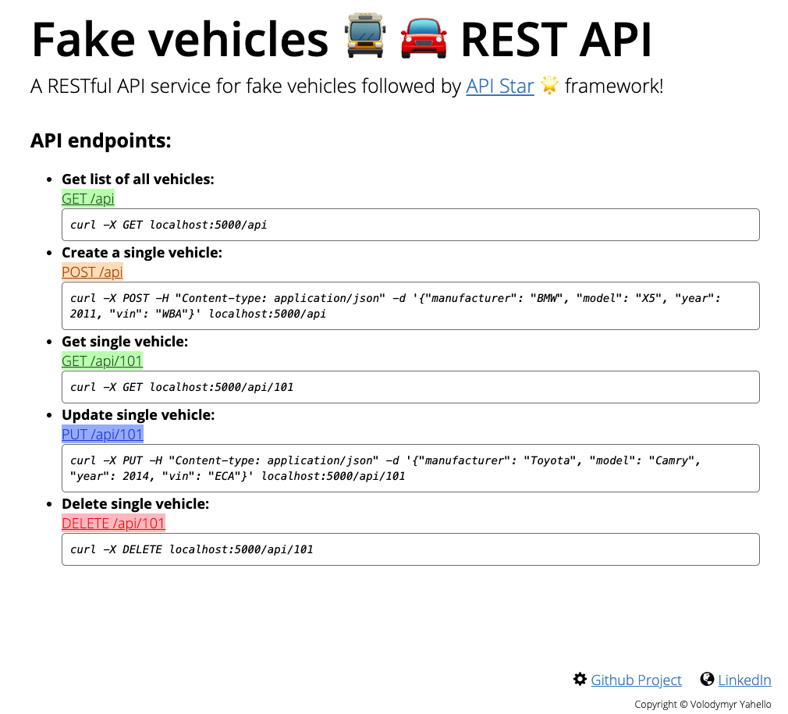

[](https://www.python.org/)
[](https://github.com/psf/black)
[](https://www.pylint.org)
[](http://flake8.pycqa.org/)
[](http://mypy-lang.org/)
[](https://travis-ci.org/vyahello/fake-vehicles-api)
[](https://coveralls.io/github/vyahello/fake-vehicles-api?branch=master)
[](LICENSE.md)
[](https://hitsofcode.com/view/github/vyahello/fake-vehicles-api)

# Fake Vehicles API
> A lightweight vehicle (fake) API written in [API Star](https://docs.apistar.com/) 🌟 python WEB API toolkit framework. 
> This project is built only as a sample REST API toolkit.
>
> Fake data was generated from https://www.mockaroo.com source.

## Tools

### Production

- python 3.8
- [API Star](https://docs.apistar.com/) framework
- [heroku](http://fake-vehicles-api.herokuapp.com) deployment

### Development
- [travis](https://travis-ci.org/) CI
- [pytest](https://pypi.org/project/pytest/) framework
- [black](https://black.readthedocs.io/en/stable/) code formatter
- [mypy](http://mypy.readthedocs.io/en/latest) static typer
- [pylint](https://www.pylint.org/) code style
- [flake8](http://flake8.pycqa.org/en/latest/) code formatter

## Usage



### Quick start

Please run next commands to start an app:
```bash
git clone git@github.com:aiopymake/fake-vehicles-api.git
pip install -r requirements.txt
python -m api
```

Then please open [localhost:5000/](http://localhost:5000/) path in your browser to obtain home page. 

## Development notes

### API endpoints
There are several endpoints already developed (others will be added soon):
  - `GET` request on `/api` endpoint to get list of all vehicles e.g:
    ```bash
    curl localhost:5000/api
    ```
  - `POST` request on `/api` endpoint to create a vehicle e.g:
    ```bash
     curl -X POST \
    -H "Content-type: application/json \"
    -d {"manufacturer": "BMW", "model": "X5", "year": 2011, "vin": "WBAWV53589P465532"}' \
    localhost:5000/api
    ```
  - `GET` request on `/api/{id}` endpoint to get single vehicle e.g:
    ```bash
    curl localhost:5000/api/99
    ```
  - `PUT` request on `/api/{id}` endpoint to update single vehicle e.g:
    ```bash
    curl -X PUT \
    -H "Content-type: application/json" \
    -d '{"manufacturer": "BMW", "model": "X5", "year": 2011, "vin": "WBAWV53589P465532"}' \
    localhost:5000/api/99
    ```
  - `DELETE` request on `/api/{id}` to delete single vehicle e.g:
    ```bash
    curl -X DELETE localhost:5000/api/99
    ```

### Testing
Project is covered with both **_unit_** and **_functional_** tests on REST API endpoints using [pytest](https://docs.pytest.org/en/latest) testing framework.

Please run next command from the root directory to start testing:
```bash
pytest
```

Run only smoke tests:
```bash
pytest -m smoke
```

Run only unit tests:
```bash
pytest -m unittests
```

Please open `test-report.html` file in your browser to see testing report.


### Deployment

Please refer to [deployment](DEPLOYMENT.md) page to get instructions on how to provision an app.

## Meta
Author – _Volodymyr Yahello_.

Distributed under the `MIT` license. See [license](LICENSE.md) for more information.

You can reach out me at:
* [vyahello@gmail.com](vyahello@gmail.com)
* [https://twitter.com/vyahello](https://twitter.com/vyahello)
* [https://www.linkedin.com/in/volodymyr-yahello-821746127](https://www.linkedin.com/in/volodymyr-yahello-821746127)

### Contributing
I would highly appreciate any contribution and support. If you are interested to add your ideas into project please follow next simple steps:

1. Clone the repository
2. Configure `git` for the first time after cloning with your `name` and `email`
3. `pip install -r requirements.txt` to install all project dependencies
4. `pip install -r requirements-dev.txt` to install all development project dependencies
5. Create your feature branch (`git checkout -b feature/fooBar`)
6. Commit your changes (`git commit -am 'Add some fooBar'`)
7. Push to the branch (`git push origin feature/fooBar`)
8. Create a new Pull Request

### What's next

All recent activities and ideas are described at project [issues](https://github.com/vyahello/fake-vehicles-api/issues). 
If you have ideas you want to change/implement please do not hesitate and create an issue.